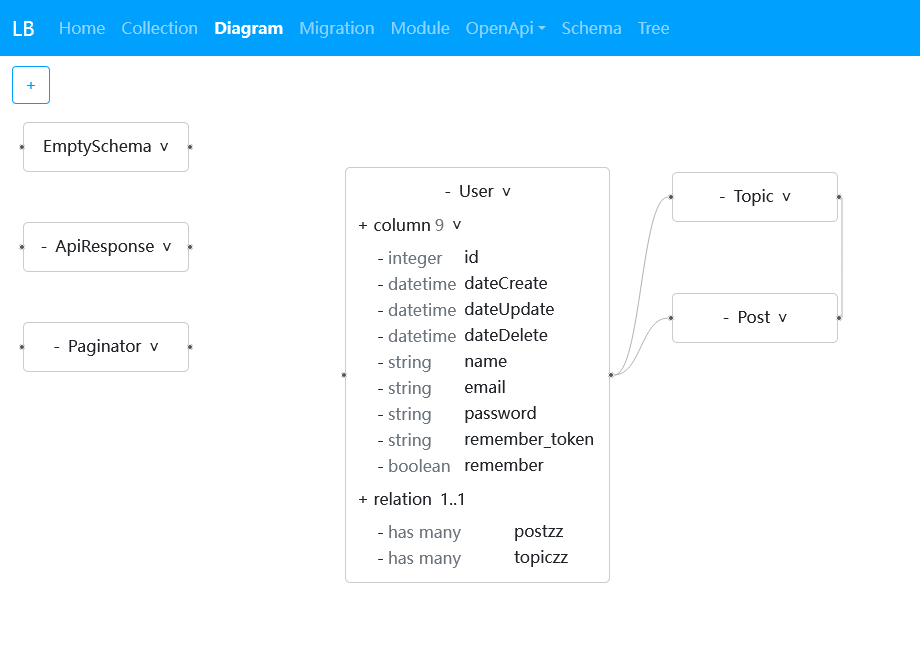

# Laravel Builder

[demo](https://googee.github.io/laravel-builder/build001)




## features

- design database schemas
- manage database migrations
- generate OpenApi document
- generate CRUD files

You no longer need to write migrations yourself, Doctrine will do it for you.

Doctrine compares files in `database/Entity` with the database schemas, and generate a migration file of their difference.


## install

[PhpStorm plugin](https://plugins.jetbrains.com/plugin/20064)

```bash
composer require --dev googee/laravel-builder

php artisan vendor:publish --provider="GooGee\LaravelBuilder\LaravelBuilderServiceProvider"

php artisan setupLaravelBuilder
```


## pages

- Collection
- Diagram
- Migration: database migration
- Module: modules in project
- OpenApi
    - Info
    - Enum
    - Example
    - Header
    - Parameter
    - Path
    - Request
    - Response
    - Server
    - Wu: OpenApi Schema
- Schema: not OpenApi Schema. including database talbes and some classes in project
- Tree: not the real files in disk


## import schema from database

- make sure Laravel server is running and database is created
- go to `Migration` page, then click `►|` button to run `php artisan migrate`
- select `Database` tab, then click `read DB tables` button, you will see a list of tables
- select tables you want to import, then click `import selected tables` button
- select a newly created Schema in sidebar, then click `▼` button to generate the Entity file
- skip 3 Schemas (EmptySchema, ApiResponse, Paginator), they are not database talbes


## how to generate migrations?

- go to `Schema` page, then click `+` button in sidebar to create a schema
- select the schema, then add some columns
- go to `Migration` page, then click `▼` button to generate the Entity file
- click `diff` button to generate a migration file
- click `►|` button to run `php artisan migrate`


## how to generate CRUD files?

- go to `Schema` page, then select `User` schema in sidebar
- select `File` tab, then click `▼` button to generate the file


## how to generate OpenApi document?

- click `OpenApi` in the menu bar
- click `toJSON` button, then copy the text
- click `editor` link, then paste in the editor


## how file is generated?

for example, lets generate the User `Entity` file.
when `▼` button is clicked, this plugin will do the following:

- GUI fetch all files in `laravel-builder/code`
- execute code in `code-helper.js`
- execute code in `file-1.js` (`1` is the id of `Entity`)
- render template `file-1.txt`
- write the result text to `database/Entity/User.php`


## how to generate custom files?

- go to `Tree` page, then select a file in sidebar
- click `edit` script button to modify the code (optional)
- click `edit` template button to modify the text
- go to `Schema` page, then select a schema in sidebar
- select `File` tab, then click `▼` button to generate the file

for example

```JavaScript
function run(data) {
    /** @type {DataForScript} */
    const ddd = data

    // define variable `entity`
    ddd.entity = ddd.db.tables.File.find(item => item.name === 'Entity')

    // define function `toString`
    ddd.toString = function(object) {
        return JSON.stringify(object)
    }
}
```

in template

```
{{ entity.name }}

{{ toString(entity) }}
```

[templating engine](https://mozilla.github.io/nunjucks/templating.html)
